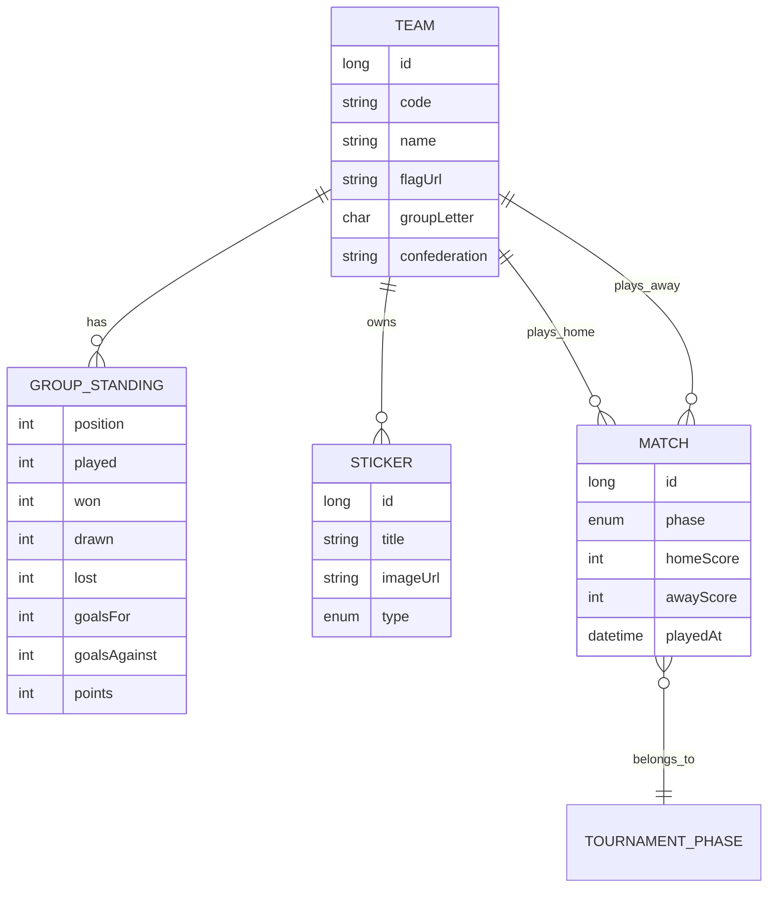

# Workshop: Álbum del Mundial 2026 con SDD

Demo paso a paso para alumnos de **Java · Spring Boot · Quarkus · Angular**.
Construimos un álbum digital del Mundial FIFA 2026: equipos, cromos/fotos, mapa de grupos
y bracket eliminatorio hasta la final.

**Duración estimada:** 4–5 horas (o 2 h en variante `/sdd-yolo`).

---

## Qué vamos a construir

```
┌─────────────────────────────────────────────────────────────┐
│  🏆 Álbum Mundial 2026                                      │
├──────────────┬──────────────┬──────────────┬────────────────┤
│  Equipos     │  Grupos      │  Álbum       │  Eliminatoria  │
│  48 selecc.  │  12 grupos   │  Cromos/fotos│  R32→Final     │
│  bandera +   │  A–L con     │  por equipo  │  árbol visual  │
│  plantilla   │  clasific.   │  progreso %  │  semis, final  │
└──────────────┴──────────────┴──────────────┴────────────────┘
```

### Datos reales del torneo (dominio)

| Concepto | Detalle |
|----------|---------|
| Formato | 48 equipos · 12 grupos de 4 |
| Clasificados | 2 primeros por grupo + 8 mejores terceros → 32 |
| Eliminatoria | R32 → R16 → Cuartos → Semis → Final (+ 3.er puesto) |
| Fechas | 11 jun – 19 jul 2026 |
| Sedes | USA, México, Canadá (16 ciudades) |

---

## Preparación (antes del taller)

> **¿Usáis Copilot, Claude, Gemini, Antigravity, Codex u OpenCode?**
> Ver [docs/guia-agentes-ia.md](guia-agentes-ia.md) — incluye tracks **Google (Antigravity)**
> y **terminal (Codex / OpenCode)**.

### 1. Instalar SDD Skills

```bash
npx skills add https://github.com/sivaprasadreddy/sdd-skills -y
```

### 2. Scaffolding del proyecto

Opción recomendada — monorepo Maven + Angular:

```bash
# Backend Spring Boot — IMPORTANTE: Boot 3.5.0+ (3.4.x falla en Initializr)
curl -sL "https://start.spring.io/starter.zip?type=maven-project&language=java&bootVersion=3.5.0&baseDir=backend-spring&groupId=com.joedayz&artifactId=mundial-album&packageName=com.joedayz.mundial&javaVersion=21&dependencies=web,data-jpa,validation,flyway,h2" -o backend-spring.zip
unzip backend-spring.zip && rm backend-spring.zip

# Frontend Angular
ng new frontend --routing --style=scss --standalone --ssr=false --skip-git
```

> **Ensayo completo:** existe una réplica verificada en `tmp/workshop-rehearsal/` con todos los pasos SDD ejecutados. Ver `tmp/workshop-rehearsal/REHEARSAL-LOG.md`.

> **Gotcha Flyway:** usar `VARCHAR(1)` para `group_letter`, no `CHAR(1)` — Hibernate falla en validación.

> **Nota Quarkus:** los alumnos avanzados pueden clonar la misma API en `backend-quarkus/`
> con `quarkus create app`. El contrato REST es idéntico; solo cambia el runtime.

### 3. Verificar que `docs/project.md` existe

Ya está precargado en este repo. Los alumnos pueden ejecutar `/sdd-init` para
regenerarlo tras añadir el scaffolding.

---

## Bloque 0 — Introducción (15 min)

**Mensaje clave:** La IA sin spec produce código que "medio funciona". SDD invierte el flujo.

```
Idea vaga  ──✗──►  Código  ──✗──►  Debug infinito

Idea  ──►  feature.md  ──►  plan.md  ──►  Código  ──►  review.md  ──►  archive
```

Mostrar el diagrama del README de [sdd-skills](https://github.com/sivaprasadreddy/sdd-skills).

---

## Bloque 1 — `/sdd-init` (20 min)

### Comando

```
/sdd-init
```

### Qué hace el agente

1. Escanea `pom.xml`, `package.json`, estructura de paquetes
2. Detecta Spring Boot, Angular, Flyway, PostgreSQL
3. Completa o actualiza `docs/project.md`
4. Pide confirmación si algo no puede detectar (misión, convenciones)

### Ejercicio para alumnos

Abrir `docs/project.md` y verificar:

- [ ] ¿El package base es correcto?
- [ ] ¿Los endpoints base `/api/v1` están documentados?
- [ ] ¿Las reglas del Mundial 2026 (48 equipos, 12 grupos) son correctas?

### Pregunta de discusión

> "¿Por qué la IA necesita este archivo antes de escribir una sola línea de código?"

---

## Bloque 2 — `/sdd-feature` (30 min)

### Comando (copiar tal cual)

```
/sdd-feature Álbum digital del Mundial FIFA 2026: catálogo de 48 selecciones con bandera y plantilla, vista de 12 grupos (A-L) con tabla de clasificación, álbum de cromos/fotos por equipo con progreso de colección, y bracket eliminatorio interactivo desde dieciseisavos hasta la final incluyendo semifinales y partido por el tercer puesto
```

### Qué produce → `feature.md`

Estructura esperada:

```markdown
# Feature: Álbum Mundial 2026

## Summary
## User Stories
- Como aficionado quiero ver los 12 grupos con su clasificación...
- Como coleccionista quiero pegar cromos de cada selección...
- Como usuario quiero seguir el bracket desde octavos hasta la final...

## Functional Requirements
- FR-01: Listar 48 equipos con código FIFA, bandera y grupo
- FR-02: Mostrar tabla de clasificación por grupo (PJ, PG, PE, PP, GF, GC, PTS)
- FR-03: Álbum de cromos por equipo (mínimo 3 cromos: escudo, plantilla, estadio)
- FR-04: Indicador de progreso de colección (% cromos conseguidos)
- FR-05: Bracket eliminatorio con fases R32, R16, QF, SF, FINAL, THIRD_PLACE
- FR-06: Detalle de equipo con foto, sede de grupo y rivales

## Acceptance Criteria
- [ ] AC-01: GET /api/v1/teams devuelve 48 equipos
- [ ] AC-02: GET /api/v1/groups devuelve 12 grupos con 4 equipos cada uno
- [ ] AC-03: La vista Grupos muestra tabla ordenada por puntos
- [ ] AC-04: El álbum muestra cromos en grid con estado conseguido/pendiente
- [ ] AC-05: El bracket renderiza al menos las 4 fases finales (SF, Final, etc.)
- [ ] AC-06: Al marcar un cromo como conseguido, el progreso se actualiza
- [ ] AC-07: Tests de integración pasan para endpoints de teams y groups

## Technical Scope
## Non-Functional Requirements
## Out of Scope
- Apuestas, streaming en vivo, autenticación OAuth
- Simulación de partidos en tiempo real
- App móvil nativa

## Open Questions
```

### Ejercicio para alumnos (10 min)

Leer `feature.md` y marcar:

1. ¿Falta algún user story?
2. ¿Algún AC es ambiguo?
3. ¿El out-of-scope es razonable para 4 horas?

---

## Bloque 3 — `/sdd-refine` (15 min)

### Comando demo

```
/sdd-refine Añadir filtro por confederación (UEFA, CONMEBOL, CONCACAF, etc.) en el listado de equipos y un cromo especial "Sede" para los 3 anfitriones: USA, México y Canadá
```

### Qué observar

- El agente muestra un **diff** antes de aplicar cambios
- Si ya existiera `plan.md`, avisaría qué pasos quedan obsoletos
- Se añade entrada en **Revision History** al final de `feature.md`

### Ejercicio opcional para alumnos

Cada uno propone un `/sdd-refine` diferente:

- "Añadir modo oscuro con colores de banderas"
- "Mostrar estadio sede en la ficha del equipo"
- "Exportar mi álbum como PDF"

Solo uno se aplica en demo; el resto queda como práctica.

---

## Bloque 4 — `/sdd-plan` (25 min)

### Comando

```
/sdd-plan
```

### Qué produce → `plan.md`

Plan esperado (orden de capas):

| Paso | Backend (Spring Boot) | Frontend (Angular) |
|------|----------------------|-------------------|
| 1 | Flyway: `V1__teams_groups.sql` + seed 48 equipos | Models + `TeamService` |
| 2 | Entidad `Team`, `GroupStanding` + repository | Componente `TeamList` |
| 3 | `TeamController` + DTOs | Componente `TeamDetail` |
| 4 | Flyway: `V2__stickers.sql` + seed cromos | Componente `AlbumGrid` |
| 5 | `StickerController` + progreso | Servicio localStorage progreso |
| 6 | Flyway: `V3__matches_bracket.sql` + seed R32→Final | Componente `BracketTree` |
| 7 | `BracketController` | Routing + navbar |
| 8 | Tests integración RestAssured | Tests componente Jasmine |
| 9 | CORS + OpenAPI | `environment.ts` + proxy |

### Tabla AC → Test (ejemplo)

| AC | Test |
|----|------|
| AC-01 | `TeamControllerIT.shouldReturn48Teams()` |
| AC-02 | `GroupControllerIT.shouldReturn12GroupsWith4TeamsEach()` |
| AC-05 | `BracketComponent.shouldRender4KnockoutPhases()` |

### Ejercicio para alumnos

Revisar el plan y responder:

> "¿Por qué la migración va antes que el controller?"

---

## Bloque 5 — `/sdd-implement` (90 min)

### Comando

```
/sdd-implement
```

### Guía del instructor — hitos cada 20 min

#### Hito 1 — Datos y equipos (min 0–20)

Backend:

```java
// Entidad simplificada
@Entity
public class Team {
    @Id @GeneratedValue
    private Long id;
    private String code;      // "ARG", "MEX"
    private String name;
    private String flagUrl;
    private Character groupLetter;  // 'A'..'L'
    private String confederation;   // "UEFA", "CONMEBOL"
}
```

Frontend: grid de 48 banderas agrupadas por confederación.

#### Hito 2 — Grupos y clasificación (min 20–40)

```
GET /api/v1/groups/A/standings

[
  { "position": 1, "team": { "code": "MEX", "name": "México" },
    "played": 3, "won": 2, "drawn": 1, "lost": 0,
    "goalsFor": 5, "goalsAgainst": 2, "points": 7 }
]
```

Vista: 12 tabs (A–L) con tabla Material/PrimeNG.

#### Hito 3 — Álbum de cromos (min 40–60)

```
GET /api/v1/stickers?team=ARG

[
  { "id": 1, "title": "Escudo", "imageUrl": "/assets/stickers/arg-badge.png", "type": "TEAM" },
  { "id": 2, "title": "Plantilla", "imageUrl": "...", "type": "SQUAD" },
  { "id": 3, "title": "Estadio", "imageUrl": "...", "type": "STADIUM" }
]
```

Progreso en `localStorage` (MVP sin auth):

```typescript
// album-progress.service.ts
markCollected(stickerId: number): void {
  const collected = this.getCollected();
  collected.add(stickerId);
  localStorage.setItem('album-progress', JSON.stringify([...collected]));
}
```

#### Hito 4 — Bracket eliminatorio (min 60–80)

Fases del enum:

```java
public enum TournamentPhase {
    GROUP, ROUND_OF_32, ROUND_OF_16, QUARTER_FINAL,
    SEMI_FINAL, THIRD_PLACE, FINAL
}
```

Frontend — árbol visual simplificado:

```
        [FINAL]
       /       \
   [SF-1]     [SF-2]
   /    \     /    \
 [QF]  [QF] [QF]  [QF]
  ...  (colapsable en móvil)
```

#### Hito 5 — Tests y pulido (min 80–90)

Verificar que todos los AC tienen test verde.

### Qué decir cuando la IA se desvía

> "Para. Relee `plan.md` paso 3. No inventes endpoints que no están en la spec."

---

## Bloque 6 — `/sdd-review` (20 min)

### Comando

```
/sdd-review
```

### Dimensiones que evalúa (explicar a alumnos)

| Dimensión | Ejemplo de finding |
|-----------|-------------------|
| AC Verification | AC-05 sin test de bracket |
| Spring conventions | `@Autowired` field injection → usar constructor |
| Security | SQL injection en query nativa |
| Test quality | Test sin patrón AAA |
| Design | Lógica de standings en el controller |

### Veredictos posibles

| Veredicto | Acción |
|-----------|--------|
| ✅ Ready to merge | Archivar |
| 🟡 Minor fixes | Archivar tras arreglos menores |
| 🟠 Requires fixes | Corregir y re-review |
| 🔴 Do not merge | Parar, no desplegar |

### Ejercicio

Pedir a un alumno que explique un finding 🟠 y proponga el fix.

---

## Bloque 7 — `/sdd-archive` (10 min)

### Comando

```
/sdd-archive album-mundial-2026
```

### Resultado

```
docs/specs-archive/album-mundial-2026/
├── feature.md
├── plan.md
├── impl-summary.md
├── review.md
└── README.md          ← resumen para futuros alumnos
```

### Mensaje final

> "Dentro de 6 meses, cuando preguntéis por qué el bracket tiene 32 equipos
> en octavos, la respuesta está en `docs/specs-archive/`, no en el chat de la IA."

---

## Variante rápida — `/sdd-yolo` (2 h)

Para una demo express:

```
/sdd-init
/sdd-yolo Álbum digital del Mundial 2026 con equipos, grupos, cromos y bracket eliminatorio
```

Un solo gate `PROCEED` antes de implementar. Si el review encuentra issues Critical/Major, se detiene.

---

## Modelo de datos (referencia)



---

## Pantallas Angular (wireframe textual)

### 1. Home / Equipos

```
┌────────────────────────────────────────────┐
│ 🏆 Álbum Mundial 2026          [Grupos][Álbum][Bracket] │
├────────────────────────────────────────────┤
│ Filtro: [Todas ▼] [UEFA ▼]   🔍 Buscar...  │
│                                            │
│ ┌──────┐ ┌──────┐ ┌──────┐ ┌──────┐        │
│ │ 🇦🇷  │ │ 🇧🇷  │ │ 🇲🇽  │ │ 🇺🇸  │  ...   │
│ │ ARG  │ │ BRA  │ │ MEX  │ │ USA  │        │
│ │ Grp J│ │ Grp D│ │ Grp A│ │ Grp D│        │
│ └──────┘ └──────┘ └──────┘ └──────┘        │
└────────────────────────────────────────────┘
```

### 2. Grupos

```
[A][B][C][D][E][F][G][H][I][J][K][L]

Grupo A — Estadio Azteca
┌───┬─────────┬────┬────┬────┬────┬────┬────┬─────┐
│ # │ Equipo  │ PJ │ PG │ PE │ PP │ GF │ GC │ PTS │
├───┼─────────┼────┼────┼────┼────┼────┼────┼─────┤
│ 1 │ México  │  3 │  2 │  1 │  0 │  5 │  2 │  7  │
│ 2 │ ...     │    │    │    │    │    │    │     │
└───┴─────────┴────┴────┴────┴────┴────┴────┴─────┘
```

### 3. Bracket

```
Dieciseisavos → Octavos → Cuartos → SEMIS → FINAL
                                      ┌─────────┐
                              ┌───────┤ SF-1    │
                              │       └─────────┘
                    ┌─────────┤
                    │         └─────────┐
              ┌─────┤                   ├─ 🏆 FINAL
              │     └─────────┐         │
              │               ├─────────┘
        (scroll horizontal en móvil)
```

---

## Track Quarkus (opcional, alumnos avanzados)

Misma API, distinto módulo:

```bash
quarkus create app com.joedayz:mundial-album-quarkus \
  --extension=rest,hibernate-orm-panache,jdbc-postgresql,flyway,smallrye-openapi
```

Comparar en el cierre del taller:

| Aspecto | Spring Boot | Quarkus |
|---------|-------------|---------|
| Arranque en dev | ~3 s | ~1 s |
| Memoria | ~250 MB | ~120 MB |
| Anotaciones | `@RestController` | `@Path` (JAX-RS) |
| Repositorio | `JpaRepository` | `PanacheRepository` |

El frontend Angular consume la misma API sin cambios (`environment.apiUrl`).

---

## Checklist del instructor

- [ ] SDD skills instaladas (`npx skills add ...`)
- [ ] Spring Boot + Angular scaffolded
- [ ] `docs/project.md` revisado
- [ ] Proyector con prompts listos (Bloques 1–7)
- [ ] Assets de banderas en `frontend/src/assets/flags/` (48 PNGs o CDN)
- [ ] PostgreSQL o H2 configurado
- [ ] Tiempo buffer de 15 min para preguntas

---

## Próximos pasos después del workshop

Features para siguientes sesiones (cada una = ciclo SDD completo):

1. `/sdd-feature` Autenticación JWT — persistir progreso del álbum en BD
2. `/sdd-feature` Simulador de resultados — recalcular bracket al cambiar marcadores
3. `/sdd-feature` Comparativa Spring Boot vs Quarkus — métricas de rendimiento
4. `/sdd-feature` PWA offline — coleccionar cromos sin conexión
